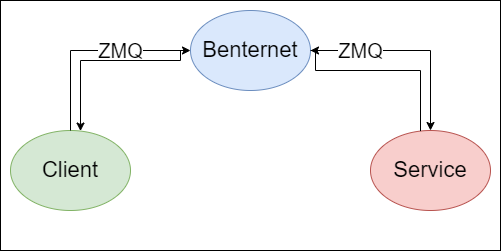
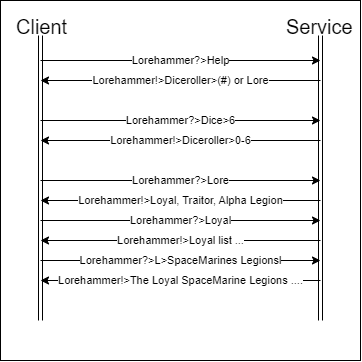

# LoreHammer

In this project i wil be making a service that gives Warhammer 40K Lore using ZMQ to talk between the service and a client using the benternet broker.

## layout

The layout between the client and service is shown here.

The Client sends its message with the right topic `Lorehammer?>ID` to the broker using ZMQ. The broker wil then send the message to the service that listens on said topic `Lorehammer?>ID>...`. The service wil then respond to that message with a different topic `Lorehammer!>ID` that the client listens to.

## Ladder Structure

This is how the commands between the Client and Service looks with the correct Topics.

The service responds to the client with a lttle info on what has been asked and (sends you to the website)/ also with links to websites with more information.
The List with all possible info can be found in the list section. 

### Requesting help

The `Lorehammer?>ID>Help` commands shows the possible topic addons for using the service by showing `Lorehammer!>ID>dice>(#) or Lore`.

### Using the DiceRoller

Using `Lorehammer?>ID>Dice>#` with # as a number wil return `Lorehammer!>ID>Dice>#` where here # is a number between 0 and the original number.

### Requesting Lore

The command `Lorehammer?>ID>Lore` wil show the three available categories to choose from `Lorehammer!>ID>Loyal, Traitor, Alpha Legion`.
The command `Lorehammer?>ID>(Loyal/L)or(Traitor/T)or(Alpha Legion/@) list` wil show all keywords from each list.

You can then choose which topic you want, for example `Lorehammer?>L>SpaceMarines Legions` with **L** for Loyal, **T** for Traitor and **@** for Alpha Legion *because Alpha Legion*.

## List
- DiceRoller (gives a random number between 0 and the given number)/(also used for *suprise me*)
- Loyal
  - The God Emperor of Mankind
  - Astra Militarum/Imperial Guard
  - Imperial Guard Regiments  
  - Imperial Guard Notable Characters
  - Astartes/SpaceMarines
  - SpaceMarines Legions
  - SpaceMarines Primarchs 
  - SpaceMarines Notable Characters
  - Adeptus mechanicus
  - Imperial Knights
  - Collegia titanica
  - Adeptus custodes
  - Adeptus sororitas
  - The Inquisition
  - Officio Assassinorum
  - Suprise me
- Traitor
  - Chaos Gods
  - Chaos Demons 
  - Traitor Guard
  - Traitor Guard Regiments 
  - Traitor Guard Notable Characters
  - Chaos SpaceMarine
  - Chaos SpaceMarine Legions 
  - Chaos SpaceMarine Primarchs  
  - Chaos SpaceMarine Notable Characters
  - Dark Mechanicum
  - Suprise me
- Alpha Legion
  - Primarchs
  - Notable Characters
  - Suprise you!
